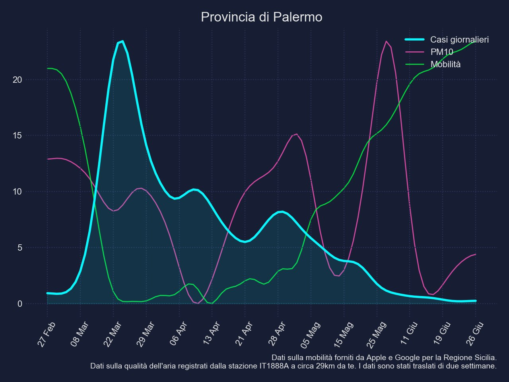
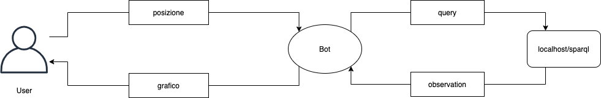
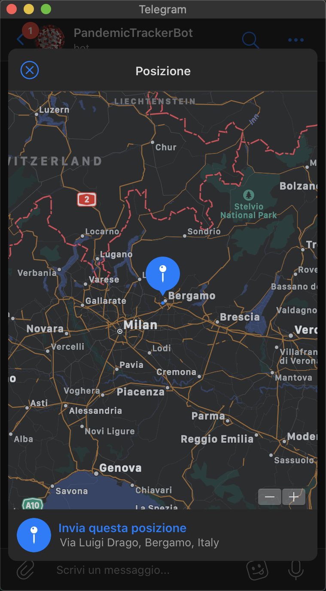
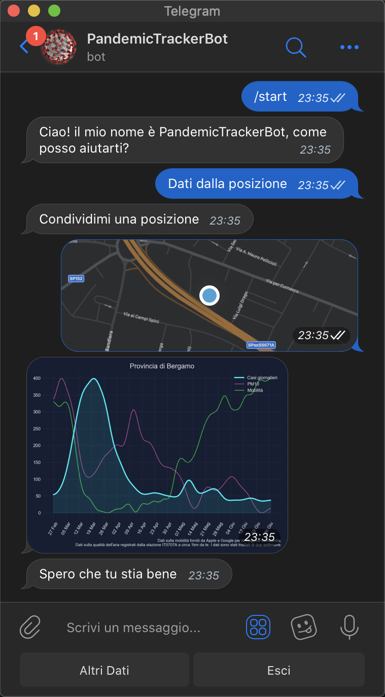

# PandemicTrackerBot



The project aims to create a dataset containing information about Covid in relation to mobility and pollution. The work focuses on merging these datasets in order to give the user the possibility, through a telegram bot, to receive all the information related to a particular location. This data will then be analyzed and shown to the user through a qualitative chart in order to make it easy to read. The merged data is accessible through a SPARQL endpoind running on the same server as the bot. All services will run on an OrangePi device, i.e. an Open-Source card based on ARM architecture on which you can run linux distributions. In particular, we have used Armbian, a linux distribution created specifically for ARM devices.

- [Dipartimento della Protezione Civile](https://github.com/pcm-dpc/COVID-19/blob/master/dati-province/dpc-covid19-ita-latest.csv)
- [Apple mobility trends](https://www.apple.com/covid19/mobility) 
- [Google mobility trends](https://www.google.com/covid19/mobility/) 
- [European Environment Agency SPARQL endpoint](https://semantic.eea.europa.eu/sparql)
- [European Environment Agency Air Quality Export](https://discomap.eea.europa.eu/map/fme/AirQualityExport.htm)




Further information can be found in our [presentation](Relazione.md) (Italian).

## Usage

In order to start your bot, create an API key using [@BotFather](https://t.me/BotFather) and then launch `TelegramBot.py` using Python 3.

```bash
$ python TelegramBot.py API_KEY
```

|  |  |
| ---- | ---- |
| Choose a location to send to the bot | Bot replies with a chart containing the results |

## License

[GNU GPLv3](LICENSE.txt)
