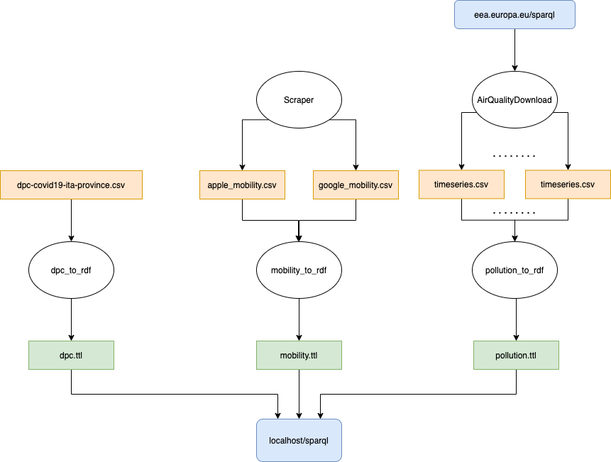

# Progetto Pandemic Tracker

## Introduzione

Il progetto ha come obbiettivo quello di creare un dataset che contenga informazioni relative al Covid in relazione alla mobilità e all'inquinamento. Il lavoro si concentra nell'unire questi dataset cosi da poter successivamente dare all'utente la possibilità, attraverso un bot telegram, di ricevere tutte le informazioni relative ad una particolare località. Queste informazioni verranno quindi elaborate e mostrate all'utente attraverso dei grafici così da renderne facile la lettura. I dati uniti sono accessibili attraverso un endpoind SPARQL in esecuzione sullo stesso server del bot. Tutti i servizi saranno eseguiti su un dispositivo chiamato *OrangePi*, ovvero una scheda *Open-Source* basata su architettura *ARM*, sulla quale possono essere eseguite distribuzioni linux e quella che abbiamo utilizzzato noi è  *Armbian*, una distribuzione di linux creata per dispositivi che funzionano con architetture *ARM*.

## Dataset utilizzati 

I dataset utilizzati sono quattro: uno per le informazioni sul coronavirus in Italia, due per la mobilità e uno per l'inquinamento.

#### Dataset Coronavirus

Il dataset utilizzato per le informazioni sull'andamento del Coronavirus in Italia è stato messo a disposizione dal Dipartimento della Protezione Civile con licenza `CC-BY-4.0`. Tutti i dati sono aggiornati giornalmente alle 18:30 e vengono erogati in formato `csv` su GitHub. Il link alla repository è il seguente [https://github.com/pcm-dpc/COVID-19](https://github.com/pcm-dpc/COVID-19), da cui abbiamo preso le informazioni [per provincia](https://github.com/pcm-dpc/COVID-19/blob/master/dati-province/dpc-covid19-ita-province-latest.csv).

#### Dataset Mobilità

I dataset sulla mobilita [Apple mobility trends](https://www.apple.com/covid19/mobility) e [Google mobility trends](https://www.google.com/covid19/mobility/) mirano a fornire informazioni su ciò che è cambiato dopo che sono entrate in vigore le politiche di contenimento del virus. Sia Google che Apple aggiornano giornalmente questi dati e li erogano in formato `csv`. Per quanto riguarda le licenze, entrambe le aziende non hanno rilasciato questi dati sotto licenze di tipo open data.

#### Dataset Inquinamento 

Il dataset sull’inquinamento, messo a disposizione da European Environment Agency e consultabile tramite la mappa [European Air Quality Index](https://airindex.eea.europa.eu/#), è il risultato dell'unione di numerosi servizi di monitorazione locale, come quello fornito da [ARPA Sicilia](https://www.arpa.sicilia.it/temi-ambientali/aria/bollettino-aria/). L'utilizzo di questo dataset serve per mettere in relazione il numero di contagi con l'inquinamento atmosferico e per vedere come le politiche di lockdown e le relative misure attuate per contrastare la diffusione del covid abbiano influito sulle concentrazioni di inquinamento atmosferico.
European Environment Agency mette a disposizione un endpoint SPARQL tramite cui è possibile accedere alle informazioni sulle stazioni, mentre le misurazioni effettive sono reperibili in formato `csv` tramite l'api [Air Quality Export](https://discomap.eea.europa.eu/map/fme/AirQualityExport.htm). Il tutto è fornito sotto licenza `ODC-BY`.

## Pipeline di elaborazione

### Acquisizione dei dati

#### Dataset Coronavirus

L'acquisizione di questo dataset non ha comportato nessuna difficoltà poiché i dati giornalieri sono reperibili all'indirizzo [dpc-covid19-ita-province-latest.csv](https://raw.githubusercontent.com/pcm-dpc/COVID-19/master/dati-province/dpc-covid19-ita-province-latest.csv). Similmente, quelli comprensivi di ogni giorno dal 24 febbraio si trovano al link [dpc-covid19-ita-province.csv](https://raw.githubusercontent.com/pcm-dpc/COVID-19/master/dati-province/dpc-covid19-ita-province.csv). Questi sono stati usati per inizializzare il database SPARQL.

#### Dataset Mobilità Google

Per quanto riguarda l'acquisizione dei dati di mobilità Google, non sembra essere disponibile un link fisso ai dati più aggiornati. Accedendo dal sito [Google mobility trends](https://www.google.com/covid19/mobility/) è possibile scaricare a mano il `csv`, ma per automatizzare la procedura così da garantire sempre i dati più aggiornati, abbiamo usato `BeautifulSoup4` per fare lo scraping del link di download dei dati

```py
soup = BeautifulSoup(html, features="html.parser")
link = soup.select_one('.icon-link')
href = link.get('href')
```

#### Dataset Mobilità Apple

Anche per i dati di Apple abbiamo automatizzato la procedura, ma questa volta non è bastato `BeautifulSoup4`, poiché il link dei dati non è disponibile al momento della visualizzazione della pagina html, ma esso è generato all'esecuzione di uno script. Abbiamo pertanto usato `selenium` con il driver `chromedriver` per avere un browser controllabile da python. Una volta caricata la pagina, abbiamo lasciato un tempo di attesa per l'esecuzione degli script e in seguito recuperato il link al file `csv`

```py
op = webdriver.ChromeOptions()
op.add_argument('headless')
driver = webdriver.Chrome('/usr/lib/chromium-browser/chromedriver', options=op)
driver.get('https://www.apple.com/covid19/mobility')

driver.implicitly_wait(5)
link = driver.find_element_by_xpath('//*[@id="download-card"]/div[2]/a')
href = link.get_attribute('href')
```

#### Dataset Inquinamento

Come anticipato, l'European Environment Agency fornisce un [endpoint SPARQL](https://semantic.eea.europa.eu/sparql) tramite cui abbiamo reperito le informazioni sulle stazioni.

```sparql
SELECT ?station ?eoi_code ?lat ?long
WHERE {
  ?station airbase:country ?nation ;
           geo:lat ?lat ;
           geo:long ?long ;
           airbase:station_european_code ?eoi_code .
  ?nation sk:notation ?nation_code .
  filter (?nation_code='IT') .
}
```

Per eseguire questa query da python abbiamo usato la libreria [`sparql-client`](https://github.com/eea/sparql-client) sviluppata a sua volta dall'European Environment Agency.

```py
results = sparql.query('https://semantic.eea.europa.eu/sparql', q).fetchall()
for row in results:
    station, eoi_code, latitude, longitude = sparql.unpack_row(row)
```

Abbiamo poi fornito il valore `eoi_code` alla seguente API per ottenere tutti i file `csv` della stazione di riferimento. Ad un file corrispondono le misurazioni per un singolo agente inquinante, tra cui `PM10`, eseguite durante quest'anno.

```py
API_URL = 'https://fme.discomap.eea.europa.eu/fmedatastreaming/AirQualityDownload/AQData_Extract.fmw?CountryCode=IT&Year_from=2020&Year_to=2020&Source=All&Output=TEXT&TimeCoverage=Year'
```

### Creazione delle ontologie

Prima di portare i dati dal formato `csv` in un formato RDF come `ttl`, abbiamo definito alcune ontologie nel formato `rdf+xml`.

Abbiamo predisposto il file `italy.rdf` con le classi `Region` e `Province`, ciascuna con le proprietà `name` e `code`. Il codice è un valore numerico a due cifre per le regioni e a tre cifre per le province. Le province hanno anche la proprietà `short_name`, mentre le regioni hanno la proprietà `has_province`, come illustrato nel seguente grafo. I dati che usano `italy.rdf` saranno presi dal file del Dipartimento della Protezione Civile. Gli URI per queste classi coincidono alla proprietà `name`. Per esempio, per la provincia di Palermo avremo gli URI `http://localhost:8000/province/Palermo` e `http://localhost:8000/region/Sicilia`.


Le altre ontologie sono state definite in file diversi per comodità di interpretazione dei dati, ma è conveniente vederle sotto un unico grafo. L'unica altra classe definita è `Observation`, che è possibile identificare con l'URI `http://localhost:8000/observation/yyyy-mm-dd`. La data si trova anche alla proprietà `date`. Ad una stessa observation sono collegati vari blank nodes, indicati in rosso, tramite la proprietà `of`. Possiamo distinguere tre tipi di blank node:

- bnode per dati del dpc, collegati ad una provincia
- bnode per dati di mobilità, collegati ad una regione
- bnode per dati di inquinamento, collegati ad una stazione (URI esterno di tipo `http://reference.eionet.europa.eu/airbase/stations/eoi-code`).


In particolare, i dati dell'inquinamento collegati ad una stazione conterranno un blank node per ogni agente inquinante che quella stazione rileva, e per ognuno di essi avremo l'URI che lo identifica (`http://reference.eionet.europa.eu/airbase/components/pollutant-id`) e un blank node per ogni misurazione effettuata in quella giornata.

Abbiamo inoltre fatto uso di alcune ontologie già esistenti:

- airbase: http://reference.eionet.europa.eu/airbase/schema/
- rdfs: http://www.w3.org/2000/01/rdf-schema#
- rdf: http://www.w3.org/1999/02/22-rdf-syntax-ns#
- geo: http://www.w3.org/2003/01/geo/wgs84_pos#
- sk: http://www.w3.org/2004/02/skos/core#

### Conversione dei dataset

Lo schema generale che abbiamo seguito per portare i dati in RDF è il seguente. Le operazioni di ottenimento dei dati sono contenute negli stessi script che si occupano di fare la conversione, ma sono stati rappresentati separatamente per esplicitare il processo.



Ognuno dei tre script crea un grafo RDF tramite la libreria `rdflib`.

```py
g = Graph()
italy = Namespace("http://localhost:8000/italy.rdf#")
geo = Namespace("http://www.w3.org/2003/01/geo/wgs84_pos#")
# ...
g.bind("italy", italy)
g.bind("geo", geo)
# ...
```

Tramite `pandas` vengono letti i file `csv` e, scorrendo riga per riga, si aggiungono le triple al grafo. Ognuno dei tre script segue gli stessi macro passi.

```py
data = pandas.read_csv('input.csv')
for _, row in data.iterrows():

  # si scelgono gli URI per le classi coinvolte
  uri_province = URIRef("http://localhost:8000/province/" + urify(row.province))
  uri_region = URIRef("http://localhost:8000/region/" + urify(row.region))
  uri_observation = URIRef("http://localhost:8000/observation/" + urify(row.date))

  # e si creano le triple con le nuove istanze
  g.add([uri_province, RDF.type, italy.Province])
  g.add([uri_region, RDF.type, italy.Region])
  g.add([uri_observation, RDF.type, observation.Observation])

  # si aggiungono le triple con i dati
  g.add([uri_province, geo.lat, Literal(row.lat)])
  g.add([uri_province, geo.long, Literal(row.long)])
  # ...

  # si creano gli eventuali blank nodes
  blank = BNode()
  g.add([uri_observation, observation.date, Literal(date)])
  g.add([uri_observation, observation.of, blank])
  g.add([blank, dpc.total_cases, Literal(row.totale_casi)])
  # ...
```

Ogni script termina esportando il grafo prodotto in un file turtle.

```py
g.serialize(destination='./output.ttl', format='ttl')
```

#### Risoluzione di conflitti

È bene notare che non c'è una compatibilità perfetta tra i vari dataset e gli script che li uniscono ne devono tenere conto. Per esempio, nel file del Dipartimento della Protezione Civile sotto la colonna `denominazione_regione` sono presenti `P.A. Trento` e `P.A. Bolzano`. Questa distinzione, però, non è presente né nei dati di Google né in quelli di Apple, che invece riportano rispettivamente `Trentino-South Tyrol` e `Trentino Alto Adige`. Per ovviare a questa incongruenza, nello script `dpc_to_rdf.py` effettuiamo il seguente controllo ed eventuale rinominazione

```py
region = row.denominazione_regione
if 'P.A.' in region:
    region = 'Trentino Alto Adige'
```

e similmente nello script `mobility_to_rdf.py`, quando si incontra una regione con nome diverso da quello utilizzato negli altri file, si fa la rinominazione ad uno standard

```py
region_name = google_row.sub_region_1
if region_name in g_en_regions:
    region_name = g_it_regions[g_en_regions.index(google_row.sub_region_1)]

apple_region_name = region_name
if region_name in a_it_regions:
    apple_region_name = a_en_regions[a_it_regions.index(region_name)]
```

### Preparazione del server SPARQL

Dopo aver installato virtuoso sul nostro server, abbiamo usato il comando `isql` da terminale per configurarlo e dargli il permesso di eseguire query federate, poiché avremo bisogno di contattare l'endpoint dell'European Environment Agency.

```sql
grant SPARQL_LOAD_SERVICE_DATA to "SPARQL";
grant SPARQL_SPONGE to "SPARQL";
```

I file in `ttl` sono stati poi caricati sempre dalla stessa shell con

```sql
DB.DBA.TTLP_MT (file_to_string_output ('dpc.ttl'), '', 'http://localhost:8000/');
DB.DBA.TTLP_MT (file_to_string_output ('mobility.ttl'), '', 'http://localhost:8000/');
DB.DBA.TTLP_MT (file_to_string_output ('pollution.ttl'), '', 'http://localhost:8000/');
```

A questo punto è possibile interrogare il server virtuoso all'indirizzo `http://localhost:8890/sparql`.

## Creazione del bot telegram


Come lato client del nostro progetto abbiamo deciso di realizzare un bot telegram tramite la libreria `python-telegram-bot` , cioè un wrapper delle API telegram. Per realizzarlo abbiamo pensato di utilizzare una struttura a conversazione (*Conversation Handler*), gestita da un automa  con uno stato iniziale, uno di uscita e 3 stati per la gesione della conversazione: `CHOICE`, `LOCATION` e `CHOOSING`

```python
conv_handler = ConversationHandler(
        entry_points=[CommandHandler('start', start)],

        states={

            CHOICE: [MessageHandler(Filters.regex('^(Stats by location|Global stats)$'), choice)],

            LOCATION: [MessageHandler(Filters.location, location)],

            CHOOSING: [MessageHandler(Filters.regex('^More stats$'), choosing)]
        },

        fallbacks=[MessageHandler(Filters.regex('^Done$'), done)]
    )
```

Lo stato iniziale è definito *Comand Handler*. Per ogni stato interno, compreso lo stato di uscita, abbiamo definito un *Message Handler* con un filtro sui dati. Ogni  *Handler* è costituito da una parte di codice che permette al bot di comunicare e gestire le richieste dell'utente.

Il comportamento del bot si sviluppa in questo modo:

+ Avviamento dopo il comando `/start` dell'utente. Saluto del bot con successiva scelta dell'azione dell'utente tra: "Stats by location" e "Done", dove la prima permette appunto di richiedere i dati tramite la posizione, mentre la seconda fa terminare il bot. Tutto questo viene gestitito dallo stato iniziale.

+ Dopo aver preso la nostra scelta ci ritroveremo nello stato `CHOICE` che la gestirà. Se la scelta fosse "Stats by location" allora il bot chiederebbe all'utente di condividere una posizione per cui l'utente vuole ottenere dei risultati.

+  Lo stato `LOCATION` gestirà la posizione dell'utente. Quindi vengono eseguite le query sui nostri dati per la creazione di un di un grafico contenente i nostri dati di output, sotto forma di immagine che verrà successivamente inviata all'utente.

  ```python
  # funzione dello stato LOCATION
  def location(update, context):
    	# logging
      user = update.message.from_user
      user_location = update.message.location
      logger.info("Location of %s: %f / %f", user.first_name, user_location.latitude,
                  user_location.longitude)
      
      reply_keyboard = [['More stats','Done']]
      
      # interazione con l'utente con la stampa della tastiera
      update.message.reply_text(
          'Here there are the data:\n... ... ...',
          reply_markup=ReplyKeyboardMarkup(reply_keyboard, resize_keyboard=True, one_time_keyboard=True))
  
      bot.sendChatAction(chat_id=update.message.chat_id, action=ChatAction.TYPING)
      
      # elaborazione dei dati
      province = get_province_for(user_location.latitude, user_location.longitude)
      station = get_station_for(user_location.latitude, user_location.longitude)
      observations = get_observations_for(province[0], station[0])
  		
      # creazione dell'immagine e invio all'utente
      image = plot_for(province, station, observations)
  
      bot.send_photo(chat_id=update.message.chat_id, photo=image)
      
      # passa allo stato CHOOSING
      return CHOOSING
  ```

+ Si passa successivamente nello stato `CHOOSING` che permette di decidere se continuare a richiedere informazioni al bot oppure di terminarlo tramite le azioni "More stats" e "Done". Se si dovesse scegliere "More stats" Ritorneremo allo stato `CHOICE`.

  

### Query in base alla posizione dell'utente

Abbiamo preparato due query separate che ci permettono, in base alla latitudine e longitudine comunicate al bot, di individuare la provincia e la regione in cui si trova l'utente e la stazione più vicina.

Per individuare tutte le province nel dataset utilizziamo `?closest_prov rdf:type italy:Province`. Dalla variabile `?closest_province` è possibile ricavare la latitudine e la longitudine che sono poi passate alla built-in function `st_distance` per calcolare la distanza dall'utente, indicata da `USER_LAT` e `USER_LONG`, che saranno sostituiti con i valori numerici prima di inviare la query. Infine, possiamo ricavare la regione associata a questa provincia tramite la tripla `?closest_region italy:hasProvince ?closest_prov`. Questo però, fornirebbe semplicemente la distanza dell'utente da ciascuna provincia. È quindi necessario prendere solo la provincia con la distanza minima, che può essere fatto ordinando i risultati per distanza e restituendo solo il primo di essi.

```sparql
select  ?closest_prov 
        ?closest_region 
        bif:st_distance(bif:st_point(USER_LAT, USER_LONG), 
                        bif:st_point(?latitude, ?longitude)) as ?dist
where {
  ?closest_prov rdf:type italy:Province ;
                geo:lat ?latitude ;
                geo:long ?longitude .
  ?closest_region italy:hasProvince ?closest_prov .
} 
order by ?dist
limit 1
```

La query per ottenere la stazione più vicina è simile a quella appena vista ma, dal momento che il nostro database non contiene informazioni sulle stazioni, è necessario effettuæ una query federata per avere l'elenco delle stazioni con la loro posizione. Inoltre, dopo averle ottenute, dobbiamo anche filtrarle per tenere solo quelle che misurano i livelli di PM10. Per realizzare questo filtro possiamo usare i dati delle osservazioni, questa volta presenti sul database locale, e assicurarci che la stazione considerata al momento, `?stat`, includa almeno un'osservazione con l'inquinante PM10. Ovvero, dobbiamo vedere se c'è almeno un blank node `?blank` per `?stat` che includa il `?pollutant` con codice `air_pollutant` `PM10`.

```sparql
select  distinct(?stat) 
        ?dist
where {
    service <https://semantic.eea.europa.eu/sparql> {
        select  distinct(?stat) 
                bif:st_distance(bif:st_point(USER_LAT, USER_LONG), 
                                bif:st_point(?s_lat, ?s_long)) as ?dist
        where {
            ?stat rdf:type airbase:Station ;
                  geo:lat ?s_lat ;
                  geo:long ?s_long ;
                  airbase:country ?nation .
            ?nation sk:notation ?nation_code .
            filter(?nation_code='IT') .
        }
    }

    ?blank airbase:Station ?stat ;
           pol:pollutant ?pollutant .
    ?pollutant pol:air_pollutant "PM10" . 
}
order by asc(?dist)
limit 1
```

### Query per ottenere le osservazioni in base a provincia e stazione

```sparql
select  ?date ?PM10 ?total_cases ?driving 
        ?retail_recreation ?grocery_pharmacy ?parks 
        ?transit_stations ?workplaces ?residential
where {
  ?observation obs:date ?date ; 
               obs:of ?p , 
                      ?r , 
                      ?s .

  ?p obs:place ?prov ;
     dpc:total_cases ?total_cases .
  ?prov italy:name ?province .
  filter (?prov = PROVINCE) .

  ?r obs:place ?reg .
  ?reg italy:name ?region ;
       italy:hasProvince ?prov .
  optional { 
    ?r am:driving ?driving ;
       gm:retail_recreation ?retail_recreation ;
       gm:grocery_pharmacy ?grocery_pharmacy ;
       gm:parks ?parks;
       gm:transit_stations ?transit_stations;
       gm:workplaces ?workplaces ;
       gm:residential ?residential .
  } 

  ?s airbase:Station STATION ;
     pol:air_quality_station_eoi_code ?eoi_code .
  { 
    select ?m_observation ?m_s avg(?concentration) as ?PM10 
    where {
      ?m_observation obs:of ?m_s .
      
      ?m_s pol:pollutant ?pollutant .
      ?pollutant pol:air_pollutant "PM10" ;
                 pol:measurement ?measurement .
      ?measurement pol:concentration ?concentration .

    } group by ?m_observation ?m_s
  }
  filter(?observation = ?m_observation) .
  filter(?s = ?m_s) .
} 
order by asc(?date)
```

### Creazione del grafo dalle osservazioni


