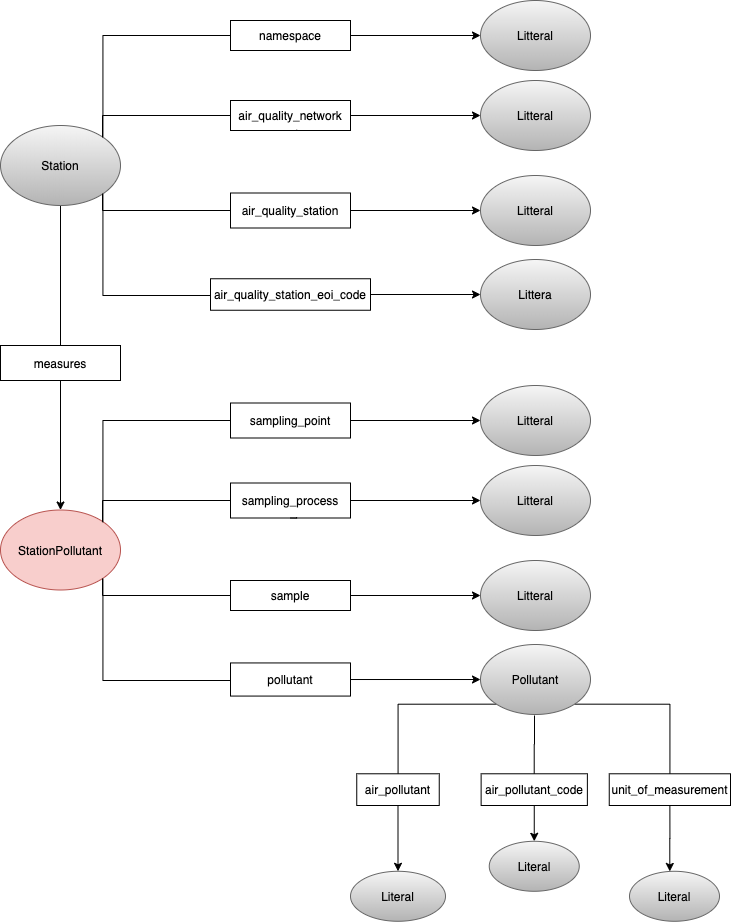

<h1 style="text-align: center">Analisi territoriale COVID-19</h1>
<h6 style="text-align: center">PandemicTrackerBot, Tecniche per la gestione degli open data</h6>
<div style="text-align: center"><small>Aldo Fumagalli, Salvatore Oliveri, Francesco Torregrossa – A.A. 2019/2020</small></div>

## Introduzione

Il progetto ha come obbiettivo quello di creare un dataset che contenga informazioni relative al Covid in relazione alla mobilità e all'inquinamento. Il lavoro si concentra nell'unire questi dataset cosi da poter successivamente dare all'utente la possibilità, attraverso un bot telegram, di ricevere tutte le informazioni relative ad una particolare località. Queste informazioni verranno quindi elaborate e mostrate all'utente attraverso dei grafici qualitativi così da renderne facile la lettura. I dati uniti sono accessibili attraverso un endpoind SPARQL in esecuzione sullo stesso server del bot. Tutti i servizi saranno eseguiti su un dispositivo OrangePi, ovvero una scheda Open-Source basata su architettura ARM sulla quale possono essere eseguite distribuzioni linux. In particolare, noi abbiamo utilizzzato Armbian, una distribuzione di linux creata appositamente per dispositivi ARM.


<!-- vscode-markdown-toc -->

* 1. [Dataset utilizzati](#Datasetutilizzati)
		* 1.1. [Dataset Coronavirus](#DatasetCoronavirus)
		* 1.2. [Dataset Mobilità](#DatasetMobilit)
		* 1.3. [Dataset Inquinamento](#DatasetInquinamento)
* 2. [Pipeline di elaborazione](#Pipelinedielaborazione)
	* 2.1. [Acquisizione dei dati](#Acquisizionedeidati)
		* 2.1.1. [Dataset Coronavirus](#DatasetCoronavirus-1)
		* 2.1.2. [Dataset Mobilità Google](#DatasetMobilitGoogle)
		* 2.1.3. [Dataset Mobilità Apple](#DatasetMobilitApple)
		* 2.1.4. [Dataset Inquinamento](#DatasetInquinamento-1)
	* 2.2. [Creazione delle ontologie](#Creazionedelleontologie)
	* 2.3. [Conversione dei dataset](#Conversionedeidataset)
		* 2.3.1. [Risoluzione di conflitti](#Risoluzionediconflitti)
* 3. [Preparazione del server SPARQL](#PreparazionedelserverSPARQL)
* 4. [Creazione del bot telegram](#Creazionedelbottelegram)
	* 4.1. [Query per la provincia](#Queryperlaprovincia)
	* 4.2. [Query per la stazione più vicina](#Queryperlastazionepivicina)
	* 4.3. [Query per le osservazioni](#Queryperleosservazioni)
	* 4.4. [Creazione del grafico dalle osservazioni](#Creazionedelgraficodalleosservazioni)

<!-- vscode-markdown-toc-config
	numbering=true
	autoSave=true
	/vscode-markdown-toc-config -->
<!-- /vscode-markdown-toc -->

##  1. <a name='Datasetutilizzati'></a>Dataset utilizzati 

I dataset utilizzati sono quattro: uno per le informazioni sul coronavirus in Italia, due per la mobilità e uno per l'inquinamento.

####  1.1. <a name='DatasetCoronavirus'></a>Dataset Coronavirus

Il dataset utilizzato per le informazioni sull'andamento del Coronavirus in Italia è stato messo a disposizione dal Dipartimento della Protezione Civile con licenza `CC-BY-4.0`. Tutti i dati sono aggiornati giornalmente alle 18:30 e vengono erogati in formato `csv` su GitHub. Il link alla repository è il seguente [https://github.com/pcm-dpc/COVID-19](https://github.com/pcm-dpc/COVID-19), da cui abbiamo preso le informazioni [per provincia](https://github.com/pcm-dpc/COVID-19/blob/master/dati-province/dpc-covid19-ita-province-latest.csv).

####  1.2. <a name='DatasetMobilit'></a>Dataset Mobilità

I dataset sulla mobilita [Apple mobility trends](https://www.apple.com/covid19/mobility) e [Google mobility trends](https://www.google.com/covid19/mobility/) mirano a fornire informazioni su come sono cambiati gli spostamenti dopo che sono entrate in vigore le politiche di contenimento del virus. Sia Google che Apple erogano questi dati in formato `csv`. Per quanto riguarda le licenze, entrambe le aziende non hanno rilasciato questi dati sotto licenze di tipo open data.

####  1.3. <a name='DatasetInquinamento'></a>Dataset Inquinamento 

Il dataset sull’inquinamento, messo a disposizione dall'European Environment Agency e consultabile tramite la mappa [European Air Quality Index](https://airindex.eea.europa.eu/#), è il risultato dell'unione di numerosi servizi di monitoraggio locale, come quello fornito da [ARPA Sicilia](https://www.arpa.sicilia.it/temi-ambientali/aria/bollettino-aria/). L'utilizzo di questo dataset serve per mettere in relazione il numero di contagi con l'inquinamento atmosferico e per vedere come le politiche di lockdown e le relative misure attuate per contrastare la diffusione del covid abbiano influito sulle concentrazioni di inquinamento atmosferico.
European Environment Agency mette a disposizione un endpoint SPARQL tramite cui è possibile accedere alle informazioni sulle stazioni, mentre le misurazioni effettive sono reperibili in formato `csv` tramite l'api [Air Quality Export](https://discomap.eea.europa.eu/map/fme/AirQualityExport.htm). Il tutto è fornito sotto licenza `ODC-BY`.

##  2. <a name='Pipelinedielaborazione'></a>Pipeline di elaborazione

###  2.1. <a name='Acquisizionedeidati'></a>Acquisizione dei dati

####  2.1.1. <a name='DatasetCoronavirus-1'></a>Dataset Coronavirus

L'acquisizione di questo dataset non ha comportato nessuna difficoltà poiché i dati giornalieri sono reperibili all'indirizzo [dpc-covid19-ita-province-latest.csv](https://raw.githubusercontent.com/pcm-dpc/COVID-19/master/dati-province/dpc-covid19-ita-province-latest.csv). Similmente, quelli comprensivi di ogni giorno dal 24 febbraio si trovano al link [dpc-covid19-ita-province.csv](https://raw.githubusercontent.com/pcm-dpc/COVID-19/master/dati-province/dpc-covid19-ita-province.csv).

####  2.1.2. <a name='DatasetMobilitGoogle'></a>Dataset Mobilità Google

Per quanto riguarda l'acquisizione dei dati di mobilità Google, non sembra essere disponibile un link fisso ai dati più aggiornati. Accedendo dal sito [Google mobility trends](https://www.google.com/covid19/mobility/) è possibile scaricare a mano il `csv`, ma per automatizzare la procedura così da garantire sempre i dati più aggiornati, abbiamo usato `BeautifulSoup4` per fare lo scraping del link di download dei dati

```python
soup = BeautifulSoup(html, features="html.parser")
link = soup.select_one('.icon-link')
href = link.get('href')
```

####  2.1.3. <a name='DatasetMobilitApple'></a>Dataset Mobilità Apple

Anche per i dati di Apple abbiamo automatizzato la procedura, ma questa volta non è bastato `BeautifulSoup4`, poiché il link dei dati non è disponibile al momento della visualizzazione della pagina html, ma esso è generato all'esecuzione di uno script. Abbiamo pertanto usato `selenium` con il driver `chromedriver` per avere un browser controllabile da python. Una volta caricata la pagina, abbiamo lasciato un tempo di attesa per l'esecuzione degli script e in seguito recuperato il link al file `csv`

```python
op = webdriver.ChromeOptions()
op.add_argument('headless')
driver = webdriver.Chrome('/usr/lib/chromium-browser/chromedriver', options=op)
driver.get('https://www.apple.com/covid19/mobility')

driver.implicitly_wait(5)
link = driver.find_element_by_xpath('//*[@id="download-card"]/div[2]/a')
href = link.get_attribute('href')
```

####  2.1.4. <a name='DatasetInquinamento-1'></a>Dataset Inquinamento

Come anticipato, l'European Environment Agency fornisce un [endpoint SPARQL](https://semantic.eea.europa.eu/sparql) tramite cui abbiamo reperito le informazioni sulle stazioni.

```sparql
SELECT ?station ?eoi_code
WHERE {
  ?station airbase:country ?nation ;
           airbase:station_european_code ?eoi_code .
  ?nation sk:notation ?nation_code .
  filter (?nation_code='IT') .
}
```

Per eseguire questa query da python abbiamo usato la libreria [`sparql-client`](https://github.com/eea/sparql-client) sviluppata anch'essa dall'European Environment Agency.

```python
results = sparql.query('https://semantic.eea.europa.eu/sparql', q).fetchall()
for row in results:
    station, eoi_code, latitude, longitude = sparql.unpack_row(row)
```

Abbiamo poi fornito il valore `eoi_code` alla seguente API per ottenere tutti i file `csv` della stazione di riferimento. Ad un file corrispondono le misurazioni per un singolo agente inquinante eseguite durante quest'anno. Per semplificare e velocizzare l'estrazione dei dati, abbiamo limitato le richieste a `&Pollutant=5`, ovvero al `PM10`, tuttavia lo script può funzionare anche senza questa limitazione.

```python
API_URL = 'https://fme.discomap.eea.europa.eu/fmedatastreaming/AirQualityDownload/AQData_Extract.fmw?CountryCode=IT&Year_from=2020&Year_to=2020&Source=All&Output=TEXT&TimeCoverage=Year'
```

###  2.2. <a name='Creazionedelleontologie'></a>Creazione delle ontologie

Prima di portare i dati dal formato `csv` in un formato RDF come `ttl`, abbiamo definito alcune ontologie.

Abbiamo predisposto il file `italy.ttl` con le classi `Country`, `Region` e `Province`, ciascuna con la proprietà `name`. Regioni e province hanno anche un valore numerico `code`, rispettivamente a due e a tre cifre. Tutte e tre sono sottoclassi di `Area` e sono presenti delle relazioni fra di loro: `Country` ha la proprietà `has_region` mentre `Region` ha la proprietà `has_province`, come illustrato nel seguente grafo.
Nei nostri script abbiamo fatto solo uso dei dati per provincia, tra quelli forniti dal Dipartimento della Protezione Civile, ma si possono facilmente espandere al livello regionale o nazionale, in quanto le ontologie li supportano. Gli URI per queste classi coincidono alla loro proprietà `name`. Per esempio, per la provincia di Palermo avremo gli URI `http://localhost:8000/province/Palermo`, `http://localhost:8000/region/Sicilia` e `http://localhost:8000/country/Italia`.


Nel file `pollution.ttl` sono presenti varie classi, molte delle quali sono state impiegate come blank nodes. Due classi che presentano URI sono invece `Station` e `Pollutant`, che avranno rispettivamente `http://localhost:8000/station/air-quality-station-eoi-code` e `http://localhost:8000/pollutant/air-pollutant-code`. Esse sono rappresentate nel grafo seguente. Queste classi contengono dei dati non direttamente reperibili dall'endpoint SPARQL dell'EEA ma presenti nei file `csv` scaricati. Pertanto, ogni individuo di queste classi deve essere riconducibile al suo corrispondente dell'EEA, e per fare ciò abbiamo usato la proprietà `owl:sameAs`.
Un'altra informazione non esplicitamente disponibile dall'endpoint dell'EEA è la relazione tra `Station` e `Pollutant`. Abbiamo creato una classe `StationPollutant` per mapparla, ma essa è sempre associata a dei blank nodes. 



Per comodità, vediamo le classi restanti nello stesso grafo. Un'altra classe definita è `Observation`, che è possibile identificare con l'URI `http://localhost:8000/observation/date`. Esiste quindi una sola istanza di `Observation` al giorno, e la data si trova sia nell'URI che tramite la proprietà `date`. Ad una stessa observation sono collegati vari blank nodes tramite la proprietà `of`. Possiamo distinguere tre tipi di blank node:

- `DpcObservation`, che indicano i dati del dpc su una `Area`
- `MobilityObservation`, che indicano i dati di mobilità su una `Area`
- `PollutionObservation`, che indicano i dati dell'inquinamento su una `Station`

Tutte e tre sono sottoclassi di `TypeOfObservation`. Come anticipiato, anche se l'ontologia supporterebbe il caricamento di dati del dpc e della mobilità per `Province`, `Region` e `Country`, nei nostri script abbiamo solo tenuto conto dei contagiati per provincia e della mobilità per regione.


Per quanto riguarda le osservazioni sulle stazioni, i dati dell'inquinamento collegati ad una stazione conterranno un blank node di classe `PollutantObservation` per ogni agente inquinante che quella stazione rileva, e per ognuno di essi avremo un blank node di classe `PollutantMeasurement` per ogni misurazione effettuata in quella giornata.

Inoltre, abbiamo fatto uso di alcune ontologie già esistenti:

- airbase: http://reference.eionet.europa.eu/airbase/schema/
- rdfs: http://www.w3.org/2000/01/rdf-schema#
- rdf: http://www.w3.org/1999/02/22-rdf-syntax-ns#
- geo: http://www.w3.org/2003/01/geo/wgs84_pos#
- sk: http://www.w3.org/2004/02/skos/core#
- owl: http://www.w3.org/2002/07/owl#

###  2.3. <a name='Conversionedeidataset'></a>Conversione dei dataset

Lo schema generale che abbiamo seguito per portare i dati in RDF è il seguente. Le operazioni di ottenimento dei dati sono contenute negli stessi script che si occupano di fare la conversione, ma sono stati rappresentati separatamente per esplicitare il processo.


Ognuno dei tre script crea un grafo RDF tramite la libreria `rdflib`.

```python
g = Graph()
italy = Namespace("http://localhost:8000/italy.ttl#")
geo = Namespace("http://www.w3.org/2003/01/geo/wgs84_pos#")
# ...
g.bind("italy", italy)
g.bind("geo", geo)
# ...
```

Tramite `pandas` vengono letti i file `csv` e, scorrendo riga per riga, si aggiungono le triple al grafo. Ognuno dei tre script segue gli stessi macro passi.

```python
data = pandas.read_csv('input.csv')
for _, row in data.iterrows():

  # si scelgono gli URI necessari per le istanze coinvolte
  uri_province = URIRef("http://localhost:8000/province/" + urify(row.province))
  uri_region = URIRef("http://localhost:8000/region/" + urify(row.region))
  # ...

  # e si creano le triple con le nuove istanze
  g.add([uri_province, RDF.type, italy.Province])
  g.add([uri_region, RDF.type, italy.Region])
  # ...

  # si aggiungono i dati
  g.add([uri_province, geo.lat, Literal(row.lat)])
  g.add([uri_province, geo.long, Literal(row.long)])
  # ...

  # si creano gli eventuali blank nodes
  blank = BNode()
  g.add([uri_observation, observation.date, Literal(row.date)])
  g.add([uri_observation, observation.of, blank])
  g.add([blank, RDF.type, mob.MobilityObservation])
  # ...
```

Ogni script termina esportando il grafo prodotto in un file turtle.

```python
g.serialize(destination='./output.ttl', format='ttl')
```

####  2.3.1. <a name='Risoluzionediconflitti'></a>Risoluzione di conflitti

È bene notare che non c'è una compatibilità perfetta tra i vari dataset e gli script che li uniscono ne devono tenere conto. Per esempio, nel file del Dipartimento della Protezione Civile sotto la colonna `denominazione_regione` sono presenti `P.A. Trento` e `P.A. Bolzano`. Questa distinzione, però, non è presente né nei dati di Google né in quelli di Apple, che invece riportano rispettivamente `Trentino-South Tyrol` e `Trentino Alto Adige`. Per ovviare a questa incongruenza, nello script `dpc_to_rdf.py` effettuiamo il seguente controllo ed eventuale rinominazione

```python
region = row.denominazione_regione
if 'P.A.' in region:
    region = 'Trentino Alto Adige'
```

e similmente nello script `mobility_to_rdf.py`, quando si incontra una regione con nome diverso da quello utilizzato negli altri file, si fa la rinominazione al nome che abbiamo scelto come standard

```python
region_name = google_row.sub_region_1
if region_name in g_en_regions:
    region_name = g_it_regions[g_en_regions.index(google_row.sub_region_1)]

apple_region_name = region_name
if region_name in a_it_regions:
    apple_region_name = a_en_regions[a_it_regions.index(region_name)]
```

##  3. <a name='PreparazionedelserverSPARQL'></a>Preparazione del server SPARQL

Dopo aver installato virtuoso sul nostro server, abbiamo usato il comando `isql` da terminale per configurarlo e dargli il permesso di eseguire query federate, poiché avremo bisogno di contattare l'endpoint dell'European Environment Agency per ottenere dati quali latitudine e longitudine di `Station`, non presenti nel nostro database.

```sql
grant SPARQL_LOAD_SERVICE_DATA to "SPARQL";
grant SPARQL_SPONGE to "SPARQL";
```

I file in `ttl` sono stati poi caricati, sempre dalla stessa shell, con

```sql
DB.DBA.TTLP_MT (file_to_string_output ('dpc_data.ttl'), '', 'http://localhost:8000/');
DB.DBA.TTLP_MT (file_to_string_output ('mobility_data.ttl'), '', 'http://localhost:8000/');
DB.DBA.TTLP_MT (file_to_string_output ('pollution_data.ttl'), '', 'http://localhost:8000/');
```

A questo punto è possibile interrogare il server virtuoso all'indirizzo `http://localhost:8890/sparql`. Inoltre, per rendere accessibili le ontologie basta creare un server nella cartella che le contiene con 

```bash
$ python3 -m http.server
```

così da avere URI come

```
http://localhost:8000/italy.ttl
http://localhost:8000/observation.ttl
http://localhost:8000/dpc.ttl
...
```

##  4. <a name='Creazionedelbottelegram'></a>Creazione del bot telegram


Come lato client del nostro progetto abbiamo deciso di realizzare un bot telegram tramite la libreria `python-telegram-bot` , cioè un wrapper delle API telegram. Per realizzarlo abbiamo pensato di utilizzare una struttura a conversazione (*Conversation Handler*), gestita da un automa  con uno stato iniziale, uno di uscita e 3 stati per la gesione della conversazione: `CHOICE`, `LOCATION` e `CHOOSING`

```python
conv_handler = ConversationHandler(
    entry_points=[CommandHandler('start', start)],

    states={

        CHOICE: [MessageHandler(Filters.regex('^(Dati dalla posizione)$'), choice)],

        LOCATION: [MessageHandler(Filters.location, location)],

        CHOOSING: [MessageHandler(Filters.regex('^Altri Dati$'), choosing)]
    },

    fallbacks=[MessageHandler(Filters.regex('^Esci$'), done)]
)
```

Lo stato iniziale è definito *Command Handler*. Per ogni stato interno, compreso lo stato di uscita, abbiamo definito un *Message Handler* con un filtro sui dati. Ogni  *Handler* è costituito da una parte di codice che permette al bot di comunicare e gestire le richieste dell'utente.

Il comportamento del bot si sviluppa in questo modo:

+ Avviamento dopo il comando `/start` dell'utente. Saluto del bot con successiva scelta dell'azione dell'utente tra: "Dati dalla posizione" e "Esci", dove la prima permette appunto di richiedere i dati tramite la posizione, mentre la seconda fa terminare il bot. Tutto questo viene gestitito dallo stato iniziale.

+ Dopo aver preso la nostra scelta ci ritroveremo nello stato `CHOICE` che la gestirà. Se la scelta fosse "Dati dalla posizione" allora il bot chiederebbe all'utente di condividere una posizione per cui l'utente vuole ottenere dei risultati.

+  Lo stato `LOCATION` gestirà la posizione dell'utente. Quindi vengono eseguite le query sui nostri dati per la creazione di un di un grafico contenente i nostri dati di output, sotto forma di immagine che verrà successivamente inviata all'utente.

  ```python
    # funzione dello stato LOCATION
    def location(update, context):
      # logging
      user = update.message.from_user
      user_location = update.message.location
      logger.info("Location of %s: %f / %f", user.first_name, user_location.latitude,
                  user_location.longitude)
  
      bot.sendChatAction(chat_id=update.message.chat_id, action=ChatAction.TYPING)
      
      # elaborazione dei dati
      province = get_province_for(user_location.latitude, user_location.longitude)
      station = get_station_for(user_location.latitude, user_location.longitude)
      observations = get_observations_for(province[0], station[0])
  
      # creazione dell'immagine e invio all'utente
      image = plot_for(province, station, observations)
      bot.send_photo(chat_id=update.message.chat_id, photo=image)
  
      # interazione con l'utente con la stampa della tastiera
      reply_keyboard = [['Altri Dati','Esci']]
      update.message.reply_text(
          'Spero che tu stia bene',
          reply_markup=ReplyKeyboardMarkup(reply_keyboard, resize_keyboard=True, one_time_keyboard=True))
      
      # passa allo stato CHOOSING
      return CHOOSING
  ```
  
+ Si passa successivamente nello stato `CHOOSING` che permette di decidere se continuare a richiedere informazioni al bot oppure di terminarlo tramite le azioni "Altri dati" e "Esci". Se si dovesse scegliere "Altri dati" Ritorneremo allo stato `CHOICE`.

###  4.1. <a name='Queryperlaprovincia'></a>Query per la provincia

Abbiamo preparato due query separate che ci permettono, in base alla latitudine e longitudine comunicate al bot, di individuare la provincia e la regione in cui si trova l'utente e la stazione a lui più vicina.

Per individuare tutte le province nel dataset utilizziamo `?closest_prov rdf:type italy:Province`. Dalla variabile `?closest_province` è possibile ricavare la latitudine e la longitudine che sono poi passate alla built-in function `st_distance` per calcolare la distanza dall'utente, indicata da `USER_LAT` e `USER_LONG`, che saranno sostituiti con i valori numerici prima di inviare la query. Infine, possiamo ricavare la regione associata a questa provincia tramite la tripla `?closest_region italy:hasProvince ?closest_prov`. Questo però, fornirebbe semplicemente la distanza dell'utente da ciascuna provincia. È quindi necessario prendere solo la provincia con la distanza minima, che può essere fatto ordinando i risultati per distanza e restituendo solo il primo di essi.

```sparql
select  ?closest_prov 
        ?closest_region 
        bif:st_distance(bif:st_point(USER_LAT, USER_LONG),
                        bif:st_point(?latitude, ?longitude)) as ?dist
where {
    ?closest_prov rdf:type italy:Province ;
                  geo:lat ?latitude ;
                  geo:long ?longitude .
    ?closest_region italy:has_province ?closest_prov .
} 
order by ?dist
limit 1
```

###  4.2. <a name='Queryperlastazionepivicina'></a>Query per la stazione più vicina

La query per ottenere la stazione più vicina è simile a quella appena vista ma, dal momento che il nostro database non contiene informazioni sulle stazioni, è necessario effettuær[&#8239;](https://www.youtube.com/watch?v=obIsgYf3yhw) una query federata per avere l'elenco delle stazioni con la loro posizione. Inoltre, dopo averle ottenute, dobbiamo anche filtrarle per tenere solo quelle che misurano i livelli di PM10. Per realizzare questo filtro possiamo usare i dati che abbiamo raccolto dalle osservazioni e associati alle classi locali `Station` e `Province`. Usiamo `owl:sameAs` per passare dalla classe della stazione restituita dall'EEA alla nostra e successivamente ci assicuriamo che tale stazione monitori PM10 con la relazione `pol:pollutant`.

```sparql
select distinct(?internal_stat) ?dist
where {
    service <https://semantic.eea.europa.eu/sparql> {
        select  distinct(?stat) 
                bif:st_distance(bif:st_point(USER_LAT, USER_LONG),
                bif:st_point(?s_lat, ?s_long)) as ?dist
        where {
            ?stat rdf:type airbase:Station ;
                  geo:lat ?s_lat ;
                  geo:long ?s_long ;
                  airbase:country ?nation .
            ?nation sk:notation ?nation_code .
            filter(?nation_code='IT') .
        }
    }

    ?internal_stat owl:sameAs ?stat ;
                   ?p ?blank .
    ?blank pol:pollutant <http://localhost:8000/pollutant/PM10> .
}
order by asc(?dist)
limit 1
```

###  4.3. <a name='Queryperleosservazioni'></a>Query per le osservazioni

Analizziamo la query in due parti per semplicità. Il primo vincolo sulla query riguarda la provincia, qui indicata nel filtro come `PROVINCE`. Per prima cosa, otteniamo `?observation` che contiene tutti i dati osservati in ogni giorno, indicato con `?date`. Nella stessa giornata vogliamo accedere alle osservazioni di contagiati nella provincia e mobilità nella regione. Questi dati sono divisi su due blank node `?p` ed `?r`, rispettivamente di classi `DpcObservation` e `MobilityObservation`. 

La tripla `?p dpc:place ?prov` potrebbe teoricamente portare `?prov` ad essere qualsiasi sottoclasse di `Area`, non solo una provincia. Come visto precedentemente, il criterio col quale otteniamo i dati ci garantisce che se `?p` è di tipo `DpcObservation`, il suo `dpc:place` porterà ad una provincia, ma per rendere la query più flessibile possiamo inserire il controllo di tipo su `?prov`. Similmente, si può fare la stessa considerazione per `?r` e `?reg`.

Una volta fatto ciò, possiamo eseguire un filtro su `?prov` per assicurarci che sia la provincia richiesta e su `?reg` per assicurarci che sia la regione contenente quella provincia. I dati di mobilità sono lasciati opzionali perché alcune giornate non state registrate. I valori nulli saranno gestiti in seguito.

```sparql
select  ?date ?PM10 ?total_cases 
        ?driving ?retail_recreation ?grocery_pharmacy 
        ?parks ?transit_stations ?workplaces ?residential
where {
    ?observation obs:date ?date ; 
                 obs:of ?p , 
                        ?r .

    ?p rdf:type dpc:DpcObservation ;
       dpc:place ?prov ;
       dpc:total_cases ?total_cases .
    ?prov rdf:type italy:Province .
    filter (?prov = PROVINCE) .

    ?r rdf:type mob:MobilityObservation ;
       mob:place ?reg .
    ?reg rdf:type italy:Region ;
         italy:name ?region ;
         italy:has_province ?prov .
    optional { 
        ?r mob:driving ?driving ;
           mob:retail_recreation ?retail_recreation ;
           mob:grocery_pharmacy ?grocery_pharmacy ;
           mob:parks ?parks;
           mob:transit_stations ?transit_stations;
           mob:workplaces ?workplaces ;
           mob:residential ?residential .
    } 
```

La seconda parte recupera i dati sulla qualità dell'aria. Dal momento che ci sono più osservazioni per ogni giornata e che siamo interessati a traslare i dati dell'inquinamento di due settimane, abbiamo deciso di scrivere una query interna che calcoli la media giornaliera per l'inquinante PM10 (calcolo limitato alla stazione richiesta, `STATION`), e che restituisca come data `?m_date` avanzato di 14 giorni. Ciò è realizzabile usando la built-in function `bif:dateadd`, e l'effetto è che le osservazioni di inquinamento identificate, per esempio, il giorno 1 gennaio, sono riportate al giorno 15 gennaio. Questo è stato fatto per simulare la latenza che c'è tra il contagio e la rilevazione tramite tampone su uno stesso individuo, così da poter avere una visione più accurata della correlazione tra i due fattori.

```sparql
    { 
        select  xsd:string(bif:dateadd('day', 14, xsd:date(?m_date))) as ?m_date 
                avg(?concentration) as ?PM10
        where {
            ?m_observation obs:of ?m_s ;
                           obs:date ?m_date .
            
            ?m_s rdf:type pol:PollutionObservation ;
                 pol:observing ?observing ;
                 pol:station STATION .

            ?observing rdf:type pol:PollutantObservation ;
                       pol:pollutant <http://localhost:8000/pollutant/PM10> ;
                       pol:pollutant_measurement ?measurement .

            ?measurement pol:concentration ?concentration .
        } 
        group by ?m_date
    }
    filter(?date = ?m_date) .

} order by asc(?date)
```

###  4.4. <a name='Creazionedelgraficodalleosservazioni'></a>Creazione del grafico dalle osservazioni

Una volta ottenute le osservazioni su contagiti, mobilità e inquinamento, abbiamo optato per rappresentare questi dati in un unico grafico qualitativo, come il seguente.


I valori restituiti dalla query SPARQL sono inseriti in un array di `numpy` per facilitarne la gesionte. La prima colonna `values[:, 0]` rappresenta i dati dell'inquinamento, la seconda `values[:, 1]` i casi totali, e le restanti sono dati della mobilità.

Innanzitutto, per passare dai dati dei contagiati totali a quelli giornalieri abbiamo usato la funzione di `diff` di `numpy` per eseguire la differenza tra i valori successivi nell'array

```python
values[:, 1] = np.clip(np.diff(values[:, 1], prepend=0), a_min=0, a_max=None)
```

combinata a `clip` per limitare i risultati ad un minimo di zero. Ciò non è necessario, ma a causa di alcuni ricalcoli, certe giornate segnano meno contagiati rispetto alle giornate precedenti, e ciò porterebbe a valori negativi.

I dati dei contagiati e della qualità dell'aria sono stati poi smussati con un filtro gaussiano come segue

```python
air_quality_data = gaussian_filter1d(values[:, 0], 3)
infections_data = gaussian_filter1d(values[:, 1], 3)
```

Per quanto riguarda le regioni, Apple fornisce solo i dati di `driving`. Per due giornate (11 e 12 maggio) i dati non sono stati riportati e sono quindi `nan`. Per ovviare, abbiamo deciso di ricopiare i valori del giorno precedente.

```python
# da qui in poi possiamo ignorare i dati di inquinamento e contagi
values = values[:, 2:]

apple = values[:, 0]
mask = np.isnan(apple)
idx = np.where(~mask, np.arange(mask.shape[0]), 0)
np.maximum.accumulate(idx, axis=0, out=idx)
apple[mask] = apple[idx[mask]]
```

Inoltre, i dati di apple sono in un range diverso rispetto a quelli di Google. Abbiamo quindi portato i dati di Apple nello stesso range di quelli di Google con

```python
values[:, 0] = apple - 100
```

Similmente, tra i dati di Google abbiamo invertito di segno quelli relativi alla mobilità verso zone residenziali

```python
values[:, 6] = -values[:, 6]
```

Per concludere l'elaborazione sui dati di mobilità, abbiamo calcolato la media tra tutte le colonne e smussato

```python
values = np.average(values, axis=1)
mobility_data = gaussian_filter1d(values, 2)
```

Infine, usando `matplotlib` possiamo rappresentare insieme i dati di `air_quality_data`, `infections_data` e `mobility_data` restituendo un'immagine tramite `fig.savefig`, che sarà poi inviata dal bot all'utente che ne ha fatto richiesta.

```python
def plot_for(province, station, observations):
  
  # ...

  buf = io.BytesIO()
  fig.savefig(buf, dpi=200, format='png')
  buf.seek(0)
  return buf
```

|      |      |
| ---- | ---- |
|  |  |
| Scelta della posizione da inviare al bot | Risposta con i risultati dell'analisi |

Il bot è raggiungibile su telegram tramite l'id [@PandemicTrackerBot](https://t.me/PandemicTrackerBot) e il suo codice sorgente, insieme agli script che servono per scaricare ed elaborare i dati, è disponibile nella repository [PandemicTracker](https://github.com/ikros98/PandemicTracker) su Github.
